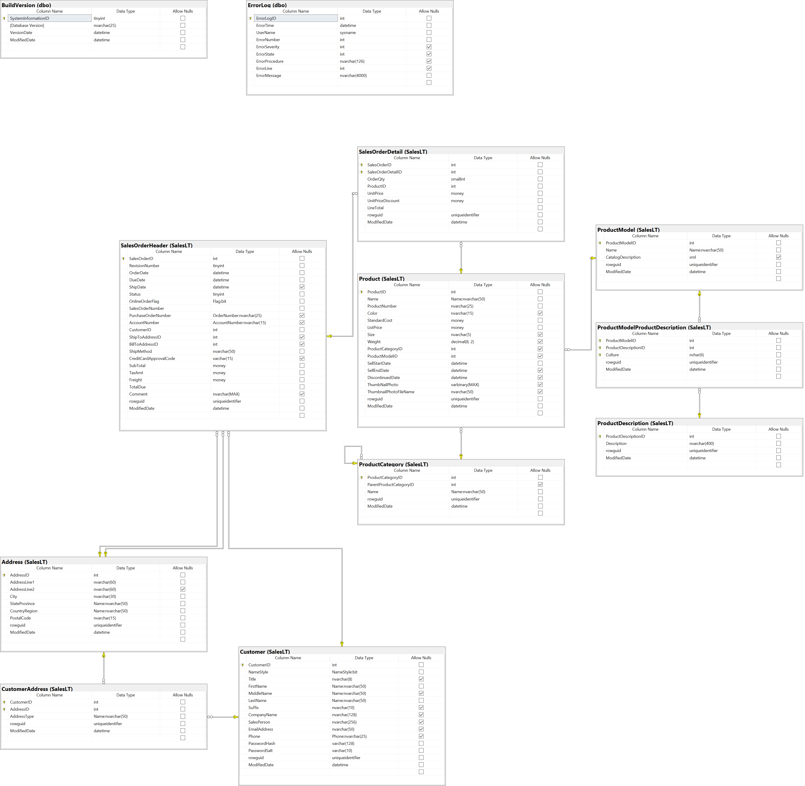

# Task 03: Entity Framework


***

## Student info

> Write your name, your estimation on how many points you will get and an estimate on how long it took to make the answer

- Student name: Laurin Novak
- Estimated points: 5
- Estimated time (hours): 6

***

## Purpose of this task

The purposes of this task are:

- to learn Entity Framework
- to learn to reverse engineer an existing database
- to learn to use Entity Framework model classes and the DbContext class

## Material for the task

> **Following material will help with the task.**

It is recommended that you will check the material before begin coding.

1. [Entity Framework Core](https://docs.microsoft.com/en-us/ef/core/)
2. [Reverse Engineering](https://docs.microsoft.com/en-us/ef/core/managing-schemas/scaffolding)

> Note! Read the Prerequisites part of the Reverse Engineering document and install the necessary tools!

> Note 2! Use some tool to read data from the database so you know how to make the queries. For VS Code check the document [SQL Server extension for Visual Studio Code](https://docs.microsoft.com/en-us/sql/tools/visual-studio-code/sql-server-develop-use-vscode#install-the-mssql-extension).

## The Task

Use Entity Framework and related tools to reverse engineer a database in the cloud. Reverse engineering produces model classes and DbContext. Use the model classes and the context to read data from the database.

> The database is hosted in Azure SQL server (Microsoft SQL Server). The connection string is given in Program.cs file. The database has very limited resources so do avoid expensive queries.

### Evaluation points

1. Reverse engineer database from the cloud. The models must be in folder `Data`. Classes must be in namespace `EFApp.Data`. Make sure that the generated DbContext class has a constructor that takes `DbContextOptions<T>` as a parameter.
2. Add a method named `ProductOrderedQtyAsync` to DbContext class to count the ordered quantity of a product. The method takes the product id as parameter and returns the ordered quantity. The method is asynchronous.
3. Add a method named `AddressesInACityAsync` to DbContext class to return top X addresses ordered ascending by field AddressLine1 from table Address. The method takes the city name and count as parameters. The method returns a list of address entities in correct order. The method is asynchronous.
4. Add a method named `ProductCategoryListAsync` to DbContext class to return a list of strings (`List<string>`) that contains product categories with their sub-categories like:

    ```text
    --1: Bikes--
    5: Mountain Bikes
    6: Road Bikes
    7: Touring Bikes
    --2: Components--
    8: Handlebars
    9: Bottom Brackets
    10: Brakes
        ...
    ```

    The main categories are surrounded with -- -- characters and the sub-categories are listed right after the main category. The method is asynchronous.

5. Add a method named `GetCustomerInfoAsync` to DbContext class to return a `CustomerInfo` object with all available properties populated (CustomerInfo class is in EFApp/Models folder). The method takes the customer's id and an address type as parameters. If customer is not found by the id then `null` is returned. If the address type is not found then the address properties are not populated. The method must not fail in any case. The method is asynchronous.

> Note! Read the task description and the evaluation points to get the task's specification (what is required to make the app complete).

## Task evaluation

Evaluation points for the task are described above. An evaluation point either works or it does not work there is no "it kind of works" step inbetween. Be sure to test your work. All working evaluation points are added to the task total and will count towards the course total. The task is worth five (5) points. Each evaluation point is checked individually and each will provide one (1) point so there is five checkpoints. Checkpoints are designed so that they may require additional code, that is not checked or tested, to function correctly.

## DevOps

There is a DevOps pipeline added to this task. The pipeline will build the solution and run automated tests on it. The pipeline triggers when a commit is pushed to GitHub on main branch. So remember to `git commit` `git push` when you are ready with the task. The automation uses GitHub Actions and some task runners. The automation is in folder named .github.

> **DO NOT modify the contents of .github or test folders.**

## Database schema


